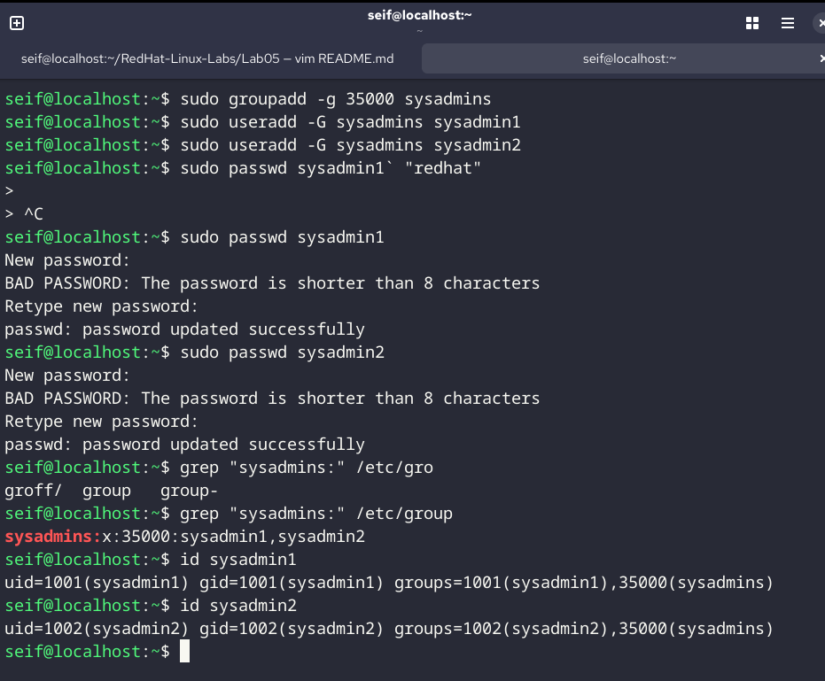
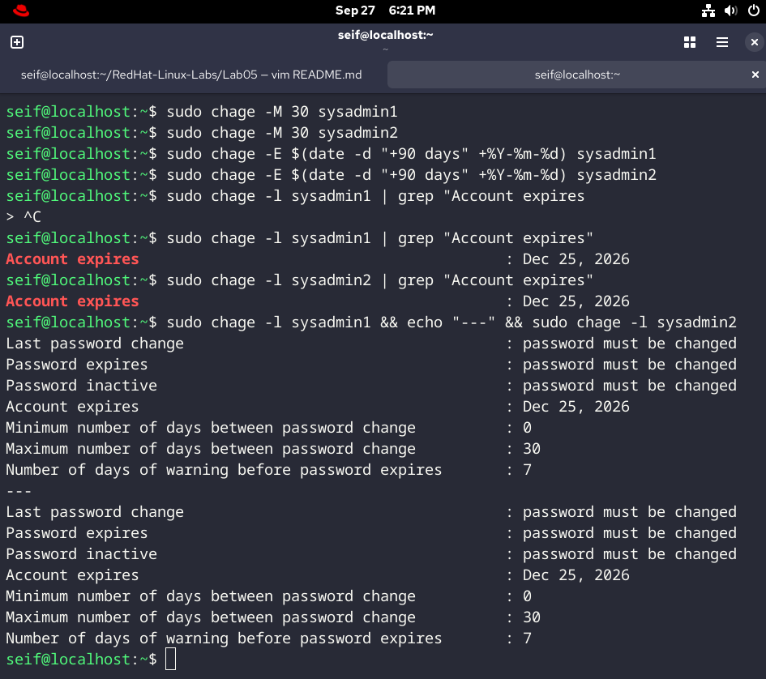
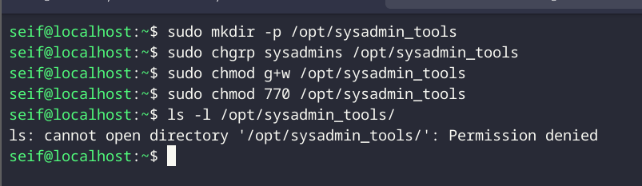
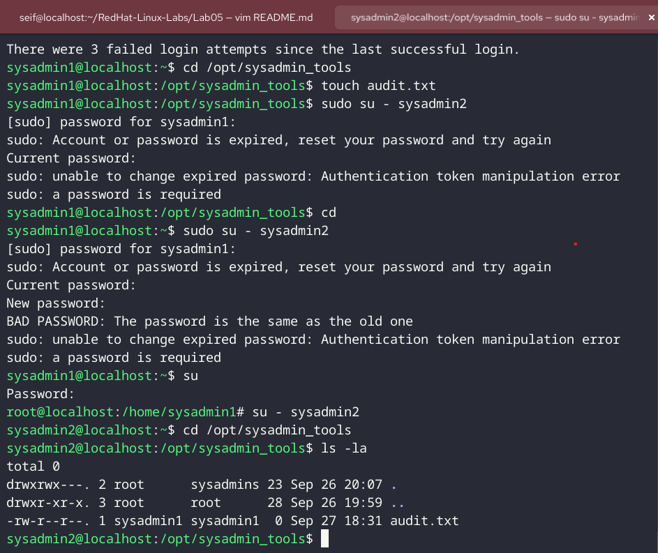

# RedHat-Linux-Labs

#                        Lab 05 - Password Policy & User Access Control

# Task 1: Group and User Creation

1- Create a new group named sysadmins and manually assign it the GID 35000.
`sudo groupadd -g 35000 sysadmins`

2- Create two users named sysadmin1 and sysadmin2. Ensure that sysadmins is their supplementary group.
`sudo useradd -G sysadmins sysadmin1`
`sudo useradd -G sysadmins sysadmin2`

3- Set the initial password for both users to redhat.
`sudo passwd sysadmin1` "redhat"
`sudo passwd sysadmin2`"redhat"

-----------------------------------------------------------------------------------

# Task 2: Password Aging and Account Expiry

1- 1. Set the maximum password age to 30 days for both users so they are prompted to change it monthly.
`sudo chage -M 30 sysadmin1`
`sudo chage -M 30 sysadmin2`

2- Set the account expiration date for both users to exactly 90 days from today. (Use the date command to calculate the correct string)
`sudo chage -E $(date -d "+90 days" +%Y-%m-%d) sysadmin1`
`sudo chage -E $(date -d "+90 days" +%Y-%m-%d) sysadmin2`

3-Force an immediate password change so that both users are required to set a new password the very first time they log into the system.
`sudo chage -l sysadmin1 | grep "Account expires`
`sudo chage -l sysadmin2 | grep "Account expires`

------------------------------------------------------------------------------------

# Task 3: Shared Directory and Permissions

1- Create a directory at the path /opt/sysadmin_tools.
`sudo mkdir -p /opt/sysadmin_tools`

2- Change the group ownership of this directory so it is owned by the sysadmins group`sudo chgrp sysadmins /opt/sysadmin_tools`

3- Using the Symbolic Method, grant the group members write access to this directory.`sudo chmod g+w /opt/sysadmin_tools`

4- Using the Octal Method, modify the permissions so that: Owner&Group Full access others no permisions
`sudo chmod 770 /opt/sysadmin_tools`

----------------------------------------------------------------------------------

# Task 4: Verification

1- Verify the directory metadata: Run a command to show the permissions, owner, and group of 
/opt/sysadmin_tools. 
`ls -ld /opt/sysadmin_tools`

2- Test User Access:
○ Switch to sysadmin1. `sudo su - sysadmin1`

○ Navigate to /opt/sysadmin_tools and create an empty file named audit.txt.
`cd /opt/sysadmin_tools`
`touch audit.txt`

○ Switch to sysadmin2 and verify you can see the file created by the first user.
`sudo su - sysadmin2`
`cd /opt/sysadmin_tools`
`ls -la`

------------------------------------------------------------------------------------
